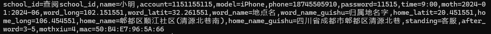

 <div align="center">

# XiXunYun-B-Pro

_✨ 大规模用户习讯云实习的最终解决方案 ✨_  
依赖于 【__青龙面板__】 【Python3.9】 

</div>

# 习讯云自动化实习 [多模块]
支持 上班、下班、假期 情景打卡签到、支持Ai攥写日、周、月报告
## 介绍
> 掌握用户的一些必要数据后就可以建立成用户数据库，保留各种信息，并且检查Token是否可用，避免反复重新登陆  
> 根据用户数据库，执行各种任务，例如上班、下班、假期打卡签到，并且支持Ai攥写日、周、月报告

支持`大规模数量用户` `不同用户不同时间签到` `模拟不定时提前与延迟(分场景)签到` `支持随机休假`  `Ai攥写日、周、月报告` `消息推送汇总`   
支持`青龙面板一键订阅`  

~~支持 日志 (日志打印支持，但是打包昨日日志函数BUG导致打包时发生卡循环，又因为青龙面板支持日志保存，所以本地日志功能未修复)~~  

❌不支持 打卡附加图片(我没有这项需求,无法激励我去创作)  

⭐本项目出发点是分享与学习，不涉及任何商业盈利项目，本人并且承诺不用于任何商业盈利事件中。  
⭐如有侵权，请联系本人删除此项目。  
⭐任何二创或源代码所造成的损失，与本人无关，本人没有督促或提供帮助。也没有任何收益。

🔑 开源许可证 [LICENSE](LICENSE)


## 目录
- [XiXunYun-B-Pro](#xixunyun-b-pro)
- [习讯云自动化实习 \[多模块\]](#习讯云自动化实习-多模块)
  - [介绍](#介绍)
  - [目录](#目录)
    - [一、自动化数据库](#一自动化数据库)
      - [**从COOKIE中解析用户的必要数据**](#从cookie中解析用户的必要数据)
      - [**数据库建立方式与逻辑**](#数据库建立方式与逻辑)
    - [二、自动化签到任务库](#二自动化签到任务库)
      - [自动化签到任务库介绍](#自动化签到任务库介绍)
      - [自动化签到任务库注意事项](#自动化签到任务库注意事项)
    - [三、自动化Ai攥写报告](#三自动化ai攥写报告)
      - [自动化Ai攥写报告介绍](#自动化ai攥写报告介绍)
        - [模式1](#模式1)
        - [模式2](#模式2)
  - [使用方式](#使用方式)
    - [目录结构](#目录结构)
    - [配置填写（一定要有！）](#配置填写一定要有)
    - [本地运行 (适合开发者)](#本地运行-适合开发者)
    - [云端执行(青龙面板) 使用直接看我](#云端执行青龙面板-使用直接看我)
      - [图文教程](#图文教程)
      - [定时任务](#定时任务)
      - [注意事项](#注意事项)
  - [推送、日志](#推送日志)
    - [推送](#推送)
    - [日志](#日志)
    - [License](#license)

### 一、自动化数据库  
#### **从COOKIE中解析用户的必要数据**
注意：COOKIE是指在本项目中的自定义区分用户的参数！即在青龙环境变量中的`cookie`参数！   
COOKIE参数：  
`school_id` `name` `account` `model` `phone` `password` `time` `moth` `word_long` `word_latit` `word_name` `word_name_guishu` `home_latit` `home_long` `home_name` `home_name_guishu` `standing` `after_word` `mothxiu` `mac`  


| 元素 | 值 | 例如 |
| ------- | ------- | ------- | 
| school_id | 学校代码 | school-id.json中查询 |
| name | 姓名 | 小明 |
| account | 学号 | 2132312 |
| model | 设备 | XiaoMi 15 |
| phone | 手机号 | 184818125 |
| password | 密码 | 123456 |
| time | 签到时间 | 9:00 |
| moth | 有效月份 | 2024-01:2024-06 |
| word_latit | 上班纬度 | 30.418515 |
| word_long | 上班经度 | 120.155115 |
| word_name | 上班完整地址 | 成都高新合作街道创新创业孵化基地 |
| word_name_guishu | 上班地址归属地 | 四川省成都市郫都区天骄路368号 |
| home_latit | 放假纬度 | 30.1181888 |
| home_long | 放假经度 | 120.1518545 |
| home_name | 放假完整地址 | 成都市金牛区欢乐谷售票处
| home_name_guishu | 放假地址归属地 | 四川省成都市金牛区西华大道41号 |
| standing | 实习岗位(用于Ai攥写报告) | 客服 |
| day_report | 是否攥写日报 | 默认"true" (全局周日月报默认"false") |
| week_report | 是否攥写周报 | 默认"true" |
| month_report | 是否攥写月报 | 默认"true" |
| report_mode | 周报月报打卡模式,1=固定日期、2=天数间隔(详细看报告逻辑) | 默认"1" |
| after_word | 0;-1;min-max | 0即不需要延迟；-1不需要下班签到；min-max 延迟签到时间的最小值与最大值(分钟)|
| mothxiu | 月休，数字则每月最大月休次数(随机休)、双休、单休 | 0-x[任意数字] (0代表不需要月休)、danxiu(单休星期天)、shuangxiu(双休周末) 注意：法定节假日必休 |
| mac | 设备物理地址 | CA:DE:D9:FD:1E:F7 |

一个完整的地址 例如：
```
school_id=837,name=小明,account=2151511,model=XiaoMI 15,phone=1818151815,password=!321Zhoujinhan,time=9:00,moth=2024-01:2024-06,word_long=131,word_latit=232,word_name=四川省成都市郫都区三和街道,word_name_guishu=四川省成都市郫都区,home_latit=30.72243,home_long=104.0337,home_name=四川省成都市金牛区欢乐谷,home_name_guishu=四川省成都市金牛区西华大道16号,standing=客服,after_word=3-8,mothxiu=5,mac=CA:DE:D9:FD:1E:F7   
```
COOKIE 可以通过 `tool/jiexi.py`(示范程序) 快捷把文字解析成COOKIE       
```
python jiexi.py 
```   
结果演示：    
输入：  
      
输出：  
      

#### **数据库建立方式与逻辑**     
解析COOKIE，分析出用户的必要信息   
使用此信息访问`习讯云`的`api`获得Token，以此验证必要信息是否正确，最后通过验证的信息进行数据库建立  

次要参数永远跟环境变量为标准。  

### 二、自动化签到任务库
#### 自动化签到任务库介绍  
_需要依赖数据库运行_  
根据数据库将每一个用户都转为定时任务分发出去  
**重要依据**  
`token` `moth` `mothxiu`  `after_word`  
Token：用户身份    
moth：检查用户是否在有限期内      
mothxiu：一个月的月休上限     
after_word: 是否需要下班打卡，下班打卡是否延迟、延迟多久
 
**逻辑**   
因为依据数据库，且相信数据库信息为最新，不再验证用户身份    
分析数据库 --> 验证当前用户是否在有效期 --> 概率判断今天类型签到/假期(每个月至少有90%概率休满最大月休息数,节假日强制放假) --> 使用`await`库分配任务[根据`time`定时] --> 达到定时的时间后执行签到

**请注意:** 假如用户已经在进行定时任务阶段延迟时，因为用户登录app，则会导致token发生变化，而正在进行的定时任务所拥有的是之前数据库中的token，会导致任务失败。建议在上下班时间段中不要让用户登录app。

默认自动化签到任务库 执行时间  8：55  
默认自动化签到任务库-下班 执行时间 18:00  

并且为了模拟真实用户，有一些特殊机制：

上班打卡可能会随机提前1-5分钟(范围指定1-5分钟，无手动控制参数)，但是可以控制用户在预定时间打卡(参数：time)。  
例如 time=9:00  自动化签到任务库在 8:55开始执行 分配任务，预计定时在 9:00 ，但是有概率 提前 1-5分钟。  
如果 time=8:00，已经过了预计的打卡时间，那么就会直接进行打卡。（需要提早打卡，修改青龙面板中的【自动化签到任务】定时时间就可以了）

下班打卡可能会延迟x分钟(用户参数中配置 after_word)。  

注意 无论是 上班打卡还是下班打卡，在基础上都可能存在额外的秒数，为了防止经常出现整点打卡的情况。  
**上班打卡任务库中包含 休息的情况，只有今天是上班打卡，下班打卡才会执行。**

#### 自动化签到任务库注意事项
上班与下班是两个独立分离的脚本，习讯云下班签到要求是上班签到后8小时，提前签到则无效，本项目高度依赖【青龙面板】，使用【青龙面板】的定时任务来控制打卡的时间，如果手动调整了最早签到时间，则请保证下班打卡任务的时间与上班打卡任务的时间相隔8小时。

### 三、自动化Ai攥写报告
#### 自动化Ai攥写报告介绍
`usr_report.py` `xixunyun_report.py`  
接入的Ai是`智谱Ai` [智谱开放平台文档](https://open.bigmodel.cn/dev/howuse/glm-4)

提示词在 `usr_report.py` 中，搜索 `request1` ，问题是习讯云的固定问题，自定义修改直接修改文本即可  

**逻辑**  
从用户的日、周、月报告第一页中分析情况，分别返回距离上一次报告的时间差。  
> 使用 最大时间-今天时间 得到天数 (习讯云使用的Unix时间戳)  

##### 模式1
日报 攥写条件 距离上一次报告的时间差大于1天  
周报 攥写条件 星期天  
月报 攥写条件 每月最后一天  

##### 模式2  
日报 攥写条件 距离上一次报告的时间差大于1天  
周报 攥写条件 距离上一次报告的时间差大于7天  
月报 攥写条件 距离上一次报告的时间差大于30天  

异步**并发**执行，此任务在一天中可以反复执行多次，不会影响到已经攥写的用户。  

攥写报告内容会根据用户的 工作岗位 来单独定制，并且避免人名地名。  

发送报告也用了异步随机延迟发送，避免同时出现日报、周报或月报在同一时间提交。  

可以并发执行，如5并发，5个线程同时启用，完成一个后分配给下一个用户，注意：需要等待任务完成。    

可用参数：  
配置文件：`data\config.json  `  
`report_max_concurrent_users` 并发最大用户数，默认1，这个不好说，要看服务器性能，还要看Ai接口并发    
8并发  （2核4G 智谱1min/30 并发没问题）    
`report_delay_min` 最小延迟时间 单位秒   
`report_delay_max` 最大延迟时间 单位秒    
如果延迟时间太大，会在同一个用户身上卡很久的  
建议 10-30秒   
## 使用方式

本地运行与云端运行(青龙面板)区别在于COOKIE的获取方式  
因为是在本地上进行开发，COOKIE的方式设计的需要与云端一样。但是云端(青龙面板)可以使用相同的环境变量读取不同用户且完成多用户模式，而本地不行，为了通用性本地使用的json文本储存来完成多用户的模式。  

采用先建立数据库后执行任务库的顺序使用   
可以使用定时任务，每天检查一次数据库的信息   
在数据库检查完毕后再启动任务库  
例如 数据库程序 运行完后 运行 任务程序     
注意：用户在手机等平台登录会导致数据库Token失效！


### 目录结构
- data                   
  - `config.json`  习讯云配置文件
  - `user.json`   数据库任务程序存放用户的数据 
- tool             
  - `jiexi.py`       快捷将文本格式化为COOKIE
  - `chachong.py`     查询有没有重复的环境变量  
- ~~`loglog.py`  调用的日志模块~~
- README.md
- requirements.txt
- `school-id.json` 学校代码
- `usr_qian.py` 签到模块
- `usr_record.py` 用户本月状况模块
- `usr_report.py` 查询报告、攥写报告、发送报告
- `usr_token.py` 通过账号密码获得用户token
- `usr_ua.py` 用户的数据查询
- `xixunyun_cookie.py` 数据库程序
- `xixunyun_report.py` 自动化任务-Ai攥写报告
- `xixunyun_sign.py` 自动化任务-上班+假期
- `xixunyun_sign_after.py` 自动化任务-下班
- `sendNotify.py` 青龙的消息推送  

### 配置填写（一定要有！）
在`data\config.json` 填写习讯云的配置信息   
``version`` 习讯云版本号  
`from` 来源   
`platform` 系统  
`Ai_peport Ai_peport` 是否启用Ai攥写报告,默认 false 关闭   
`ZhipuAI_model` 智谱Ai模型,默认 `glm-4-flash`  
`ZhipuAI_key` 智谱Ai密钥  注意，如果你的并发数量不高，请不要让设置并行数字太大    
`report_max_concurrent_users` 并发最大用户数，默认1，如果跟不上请求，请降低此数值      
`pushMessageReduction` 消息是否精简，默认关闭。精简后不会输出成功用户，只会输出失败用户与汇总。如果用户很多建议打开     
**`key`** 习讯云打卡经纬度加密公钥，必须进行习讯云认证的公钥加密，否则打卡地址会被拒收。      
如果没有 `key`  无法进行签到功能！！！！！！！！！！！！！   只能建立数据库   
例如：
```
{
    "name":"习讯云配置文件",
    "config":[
        {
            "version": "4.9.7",
            "from":"app",
            "platform": "android",
            "pushMessageReduction":"false", 
            "Ai_peport": {
                "Ai_peport": "false",
                "ZhipuAI_model": "glm-4-flash",
                "ZhipuAI_key": "",
                "report_max_concurrent_users": 1,
                "report_delay_min": 10,
                "report_delay_max": 30
            },
            "key":""
        }
    ]
}
```
你可以通过阅读 习讯云源代码 获得。    

青龙面板同样修改    
青龙面板->脚本管理->lanzeweie_xixunyun-b->data->config.json    
  

### 本地运行 (适合开发者)
```
pip install -r  requirements.txt
```
`data/env.json` 填写用户的COOKIE   


首先建立数据库  
```
python xixunyun_cookie.py
```
建立数据库后执行任务库  
```  
python xixunyun_sign.py
```  

### 云端执行(青龙面板) 使用直接看我  
`青龙面板` 版本要求：只要是拥有订阅功能的青龙面板均满足   

**使用教程**：  
1.订阅仓库 
青龙面板->订阅管理->创建订阅->复制粘贴到名称
```
ql repo https://github.com/hub660/xixunyun.git "xixunyuna_cookie|xixunyunb_cookie|xixunyun_sign|xixunyun_sign_after|xixunyun_report" "" "^usr_.*|data/|sendNotify" "" "json|py" 
```
最后再次在名称填写 习讯云打卡签到-B 即可 

定时更新规则  
一个月最后一天23点更新   
`0 23 28-31 * *`

最后点击运行即可   
*需要打开自动创建定时任务*  

2.配置环境变量   
青龙面板->环境变量->新建变量   
建立环境变量  `XIXUNYUN_COOKIE`  
填写 COOKIE 即可，多个用户重复建立即可 

3.安装依赖  
青龙面板->依赖管理->Python3->创建依赖->自动拆分(是)->粘贴依赖到名称  
**依赖**  
```
certifi
charset-normalizer
chinese-calendar
idna
pyasn1
requests
rsa
zhipuai
```
等待完成安装即可  

#### 图文教程    
1.订阅  
    
  
2.新建变量  
  

#### 定时任务

`xixunyun_sign.py` 是依据 `xixunyun_cookie.py` 的数据，所以 `xixunyun_cookie.py` 数据必须是最新，如果无法保证 数据永远最新，请让 `xixunyun_sign.py` 执行之前运行 `xixunyun_cookie.py`    
例如：
提前1分钟运行`xixunyun_cookie.py`  再运行 `xixunyun_sign.py`  
  
  

#### 注意事项  
一切都是为了模拟真实用户
_如果用户的签到时间**小于**任务库分配任务的时间则会立即执行_   
_定时时间有小概率事件发生随机提前【1-5分钟】_  
_有小概率发生不会休满一个月最大月休数_  


## 推送、日志 
变量 `bot_message` 存放推送的信息   
   
      

### 推送
(青龙面板)      
直接配置青龙面板本身的机器人推送即可  

### 日志
(青龙面板)   
日志管理    

### License

本项目采用 [Creative Commons](./LICENSE) 许可证进行授权。具体条款如下：

- **署名（BY）**：您必须给予适当的署名，提供指向许可证的链接，并说明是否进行了更改。您可以以任何合理的方式做到这一点，但不得以任何方式暗示授权人对您或您的使用方式的支持。
  
- **非商业性（NC）**：您不得将本作品用于商业目的。
  
- **禁止演绎（ND）**：如果您重混、转换或以其他方式构建本作品，您不得分发修改后的作品。

如需了解更多详细信息，请查看 [Creative Commons](./LICENSE)
